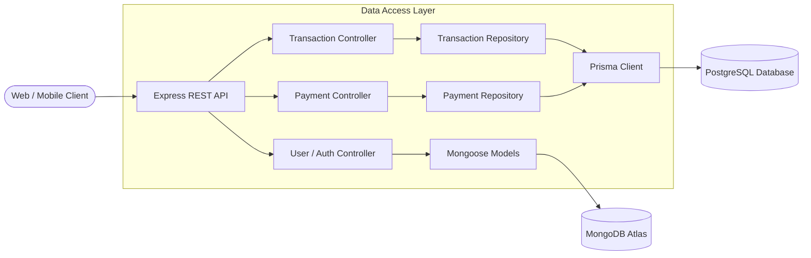

# 🏦 FinTrackAI - Backend API

Robust, scalable RESTful API service powering the **FinTrackAI** ecosystem (Web & React Native Mobile). Built on a high-performance **Polyglot Persistence Architecture** (**PostgreSQL** via **Prisma ORM** for transactions and subscription payments; **MongoDB** via **Mongoose** for user identity and contact messaging). Features automated financial statement parsing (PDF/CSV), JWT & Google OAuth authentication, Razorpay subscription billing, Nodemailer notifications, and comprehensive administrative controls.

---

## 🚀 Features

- **Polyglot Persistence & Data Integrity**
  - **Relational Financial Engine (PostgreSQL + Prisma)**: Strictly-typed schema, ACID guarantees, and composite B-tree indexes for lightning-fast queries and aggregations.
  - **Subscription Billing (PostgreSQL + Prisma)**: Atomic plan updates, payment auditing, and Razorpay order/payment ledger tracking.
  - **User & Inquiries Document Store (MongoDB + Mongoose)**: Flexible user profiles, OAuth identities, contact requests, and newsletter leads.
  - **Zero Breaking Changes**: Repository layer seamlessly maps both `id` and `_id` on all record outputs for seamless client compatibility across React Web, React Native, and iOS.
- **Authentication & Security**
  - Secure email/password authentication using bcrypt hashing & JWT tokens.
  - Google OAuth 2.0 integration via Passport.js.
  - Strict role-based authorization (User & Admin).
  - Rate limiting, security headers, and maintenance mode middleware.
- **Statement & Receipt Parsing**
  - Automated statement ingestion supporting **CSV** and **PDF** formats.
  - Intelligent transaction extraction (`pdf-parse`, `csv-parser`) and auto-categorization.
  - Subscription plan-based upload quota enforcement.
- **Financial Analytics & Dashboard**
  - Real-time income, expense, balance, and savings rate calculations.
  - Category-level breakdown and monthly trend aggregations directly powered by PostgreSQL repository queries.
  - Custom report generation and download.
- **Payments & Subscriptions**
  - Razorpay order creation and HMAC-SHA256 signature verification.
  - Tiered subscription management (Free, Pro, Enterprise).
  - Synchronized user plan upgrade across databases upon successful payment.
- **Admin Management Suite**
  - User management (listing, status toggling, deletion with cross-database cascade cleanup).
  - Platform analytics and user growth tracking.
  - Contact message handling with direct email responses.
  - Maintenance mode toggle and broadcast notifications.
- **Communication & Notifications**
  - Automated welcome emails and payment receipts using Nodemailer (SMTP).
  - Newsletter subscription management.

---

## 🏛️ Polyglot Architecture & Data Layer

FinTrackAI combines the strengths of relational and document databases:

| Domain | Database | Access Layer / Driver | Key Characteristics |
| :--- | :--- | :--- | :--- |
| **Transactions & Ledger** | PostgreSQL (Supabase / Local) | Prisma ORM (`@prisma/client`) | ACID compliance, composite indexes (`[userId, date]`, `[userId, category]`, `[userId, type]`, `[userId, uploadId]`), high-speed aggregations. |
| **Payments & Billing** | PostgreSQL (Supabase / Local) | Prisma ORM (`@prisma/client`) | Strict audit trail, order & payment ID indexing (`[razorpayPaymentId]`, `[razorpayOrderId]`, `[userId, createdAt]`). |
| **Users & Authentication** | MongoDB Atlas | Mongoose ODM | Flexible document schema, embedded preference fields, OAuth metadata. |
| **Contacts & Messages** | MongoDB Atlas | Mongoose ODM | Unstructured inquiry payloads and communication history. |



---

## 🛠️ Tech Stack

| Component | Technology | Version |
| :--- | :--- | :--- |
| **Runtime** | Node.js | `>= 16.0.0` |
| **Framework** | Express.js | `^4.18.2` |
| **Relational Database** | PostgreSQL (Supabase / Self-hosted) | `>= 15.0` |
| **ORM** | Prisma ORM (`@prisma/client`, `prisma`) | `^5.22.0` |
| **Document Database** | MongoDB Atlas with Mongoose ODM | `^7.5.0` |
| **Auth** | JSONWebToken (`jsonwebtoken`), Passport.js (`passport-google-oauth20`), `bcryptjs` | |
| **File Processing**| Multer (`multer`), `pdf-parse`, `csv-parser` | |
| **Payment Gateway**| Razorpay Node SDK (`razorpay`) | `^2.9.6` |
| **Email Service** | Nodemailer (`nodemailer`) | `^6.9.4` |
| **Dev Tools** | Nodemon, Prisma Studio / CLI | `^3.0.1` / `^5.22.0` |

---

## 📁 Project Structure

```
backend/
├── authentication/           # User schema & authentication logic (signup, login, Google OAuth)
│   ├── User.js               # MongoDB User model & schema
│   ├── login.js              # Login handler & JWT creation
│   └── signup.js             # User registration handler
├── config/                   # Configuration managers
│   └── postgres.js           # Prisma client singleton & PostgreSQL connection verifier
├── middleware/               # Auth, security, and plan limit middlewares
│   ├── strictAuth.js         # JWT validation & user extraction
│   └── planLimits.js         # Upload limit checks based on active subscription tier
├── models/                   # Mongoose Database Schemas
│   └── Contact.js            # Contact submissions schema
├── prisma/                   # Prisma ORM Definitions
│   └── schema.prisma         # Transaction and Payment PostgreSQL schemas & indexes
├── repositories/             # Data Access Layer for PostgreSQL
│   ├── transactionRepository.js  # Transaction CRUD, filters, aggregations, dual ID mapping
│   └── paymentRepository.js      # Payment creation, queries, order lookup, dual ID mapping
├── routes/                   # Modular Express route handlers
│   ├── authRoutes.js         # Google OAuth & session routes
│   ├── dashboardRoutes.js    # Dashboard metrics routes
│   ├── reportRoutes.js       # Report generation routes
│   └── user.js               # User management routes
├── scripts/                  # Database migration & benchmarking utilities
│   ├── migrateTransactionsToPostgres.js # MongoDB -> PostgreSQL transaction migration
│   ├── migratePaymentsToPostgres.js     # MongoDB -> PostgreSQL payment migration
│   └── benchmarkTransactions.js         # Performance benchmark suite
├── uploads/                  # Temporary file upload staging directory
├── adminController.js        # Admin metrics, user CRUD, cascade deletion, maintenance
├── contactController.js      # Contact forms & email reply handling
├── dashboard.js              # Aggregated dashboard metrics & insights
├── database.js               # MongoDB connection handler
├── emailService.js           # Nodemailer transport & HTML email templates
├── googleAuth.js             # Passport Google Strategy configuration
├── newsletterController.js   # Newsletter subscription management
├── paymentController.js      # Razorpay order creation & payment verification
├── pdfUtils.js               # PDF & CSV parsing and categorization engine
├── server.js                 # Express application entrypoint & routing table
├── transactionController.js  # Transaction endpoints (powered by transactionRepository)
├── uploadController.js       # File upload handler & parser orchestrator
├── userController.js         # User profile and account operations
├── Dockerfile                # Docker containerization config
├── vercel.json               # Serverless deployment configuration
└── package.json              # Project dependencies & scripts
```

---

## ⚙️ Environment Variables

Create a `.env` file in the `backend/` directory based on `backend/.env.example`:

```env
# Server Configuration
NODE_ENV=development
PORT=8000

# Polyglot Database Configuration
# MongoDB (User Accounts, Authentication, Contacts)
MONGODB_URI=mongodb+srv://<username>:<password>@cluster0.mongodb.net/fintrackai?retryWrites=true&w=majority

# PostgreSQL (Financial Transactions & Payments via Prisma)
# Note: For Supabase, use the Transaction Pooler connection string (port 6543) for IPv4 compatibility:
DATABASE_URL=postgresql://postgres.<ref>:<password>@aws-0-<region>.pooler.supabase.com:6543/postgres?pgbouncer=true

# JWT & Authentication
JWT_SECRET=your_super_secure_jwt_secret_key
JWT_EXPIRE=7d
SESSION_SECRET=your_session_secret_key

# Google OAuth 2.0
GOOGLE_CLIENT_ID=your_google_client_id.apps.googleusercontent.com
GOOGLE_CLIENT_SECRET=your_google_client_secret

# Frontend & CORS Configuration
FRONTEND_URL=http://localhost:5173
CORS_ORIGIN=http://localhost:5173

# Payment Gateway (Razorpay)
RAZORPAY_KEY_ID=rzp_test_your_key_id
RAZORPAY_KEY_SECRET=your_razorpay_secret_key

# Email Service (Nodemailer SMTP)
EMAIL_HOST=smtp.gmail.com
EMAIL_PORT=587
EMAIL_USER=your_email@gmail.com
EMAIL_PASS=your_app_password
EMAIL_FROM_NAME="FinTrackAI Team"

# File Uploads
MAX_FILE_SIZE=5242880 # 5MB in bytes
UPLOAD_PATH=./uploads
```

---

## 🚦 Getting Started

### 1. Prerequisites
- [Node.js](https://nodejs.org/) (version `>= 18.x` recommended)
- [MongoDB](https://www.mongodb.com/) (Local instance or MongoDB Atlas cluster)
- [PostgreSQL](https://www.postgresql.org/) (Local instance or [Supabase](https://supabase.com/))
- [npm](https://www.npmjs.com/) or [yarn](https://yarnpkg.com/)

### 2. Installation
```bash
# Navigate to backend directory
cd backend

# Install dependencies
npm install
```

### 3. Initialize PostgreSQL with Prisma
Sync the Prisma schema to your PostgreSQL database:
```bash
# Generate Prisma Client
npx prisma generate

# Push schema to PostgreSQL (creates tables & composite indexes)
npx prisma db push
```

*(Optional)* If you have legacy records in MongoDB that need migration into PostgreSQL:
```bash
# Migrate existing transactions
node scripts/migrateTransactionsToPostgres.js

# Migrate existing subscription payments
node scripts/migratePaymentsToPostgres.js

# (Optional) Benchmark query latency
node scripts/benchmarkTransactions.js
```

### 4. Running Locally

```bash
# Start in development mode with auto-reload
npm run dev

# Start in production mode
npm start
```
The server will start at `http://localhost:8000` (or the configured `PORT`), connecting to both MongoDB and PostgreSQL upon startup.

---

## 📡 API Reference Overview

### Health Check
- `GET /` - Root health check & API status
- `GET /api/health` - Deployment uptime status

### Authentication
- `POST /api/auth/register` - Register a new user account
- `POST /api/auth/login` - User login with JWT token return
- `POST /api/auth/admin/login` - Admin login
- `GET /api/auth/google` - Initiate Google OAuth flow
- `GET /api/auth/google/callback` - Google OAuth callback

### Dashboard & Analytics (Protected)
- `GET /api/dashboard` - Get summarized financial stats & charts data
- `PUT /api/dashboard/profile` - Update user profile settings

### Transactions (Protected - Powered by PostgreSQL Repository)
- `GET /api/transactions` - Fetch user transactions with filters, search, and pagination
- `POST /api/transactions` - Create a single manual transaction
- `PUT /api/transactions/:id` - Update an existing transaction
- `DELETE /api/transactions/:id` - Delete a transaction

### Statements & File Upload (Protected)
- `POST /api/upload/file` - Upload statement file (PDF/CSV) & parse transactions directly into PostgreSQL
- `POST /api/upload/transactions` - Alternative batch upload endpoint
- `POST /api/reports/generate` - Generate formatted financial summary report

### Payments & Subscription (Protected - Powered by PostgreSQL Repository)
- `POST /api/payment/create-order` - Create a Razorpay payment order
- `POST /api/payment/process` - Verify HMAC signature, save payment to PostgreSQL, and upgrade user tier
- `GET /api/payment/history` - Retrieve user payment history from PostgreSQL
- `GET /api/subscription/status` - Check current active plan & quota

### User & Admin Operations
- `GET /api/user/profile` - Get logged-in user profile
- `PUT /api/user/profile` - Update profile data
- `GET /api/admin/stats` - Platform-wide statistics (Admin only)
- `GET /api/admin/users` - Paginated user directory (Admin only)
- `DELETE /api/admin/users/:id` - Delete user account with cascade cleanup across MongoDB & PostgreSQL (Admin only)
- `POST /api/admin/maintenance` - Toggle maintenance mode (Admin only)
- `POST /api/contact/send` - Submit public contact message
- `POST /api/newsletter/subscribe` - Newsletter subscription

---

## 🐳 Docker Deployment

You can containerize the backend using the included `Dockerfile`:

```bash
# Build Docker image
docker build -t fintrackai-backend .

# Run Docker container
docker run -p 8000:8000 --env-file .env fintrackai-backend
```
