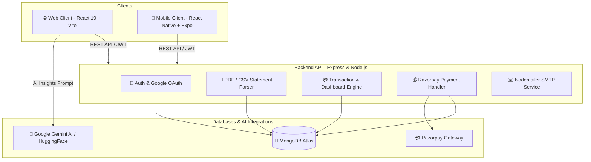

# 💰 FinTrackAI - Full-Stack AI-Powered Financial Tracking Platform

[](https://nodejs.org/)
[](https://expressjs.com/)
[](https://react.dev/)
[](https://reactnative.dev/)
[](https://expo.dev/)
[](https://tailwindcss.com/)
[](https://www.mongodb.com/)

**FinTrackAI** is a multi-platform financial intelligence ecosystem designed to simplify personal and small-business finances. It combines **automated statement ingestion (PDF & CSV)**, **AI-powered transaction categorization and financial insights (Google Gemini & Hugging Face)**, **real-time analytics dashboards**, **Razorpay subscription billing**, and a seamless experience across **Web (React + Vite)** and **Mobile (React Native + Expo)**.

---

## 🏛️ Project Architecture & Components

The repository is structured as a unified monorepo containing three core sub-projects:

```
FintrackAI/
├── 📁 backend/          # Node.js + Express + MongoDB REST API & AI Parser Engine
│   └── 📄 README.md     # Dedicated Backend Documentation
├── 📁 web/              # React 19 + Vite + Tailwind CSS v4 Web Client
│   └── 📄 README.md     # Dedicated Web Client Documentation
├── 📁 mobile/           # React Native + Expo SDK 54 iOS & Android Mobile App
│   └── 📄 README.md     # Dedicated Mobile App Documentation
└── 📄 README.md         # Repository Master Overview & Architecture Guide
```

### Sub-Project Quick Links:
- 📖 [**Backend Documentation (`backend/README.md`)**](file:///backend/README.md)
- 📖 [**Web Client Documentation (`web/README.md`)**](file:///web/README.md)
- 📖 [**Mobile App Documentation (`mobile/README.md`)**](file:///mobile/README.md)

---

## ⚡ System Flow & Architecture



---

## 🚀 Quick Start (Running the Full Stack)

### 1. Prerequisites
- **Node.js**: version `18.x` or higher
- **npm**: version `9.x` or higher
- **MongoDB**: A running local instance or free MongoDB Atlas URI
- **Expo Go App** (optional, for running the mobile app on a physical phone)

---

### 2. Setting Up & Running the Backend
1. Open a new terminal and navigate to `backend/`:
   ```bash
   cd backend
   npm install
   ```
2. Create `backend/.env` (see [backend/README.md](file:///backend/README.md) for full configuration).
3. Start the backend server:
   ```bash
   npm run dev
   ```
   *The API will be live at `http://localhost:8000`.*

---

### 3. Setting Up & Running the Web Client
1. Open a second terminal and navigate to `web/`:
   ```bash
   cd web
   npm install
   ```
2. Create `web/.env` (see [web/README.md](file:///web/README.md) for configuration).
3. Start the Vite development server:
   ```bash
   npm run dev
   ```
   *The Web application will open at `http://localhost:5173`.*

---

### 4. Setting Up & Running the Mobile App
1. Open a third terminal and navigate to `mobile/`:
   ```bash
   cd mobile
   npm install
   ```
2. Start the Expo development packager:
   ```bash
   npm start
   ```
3. Run on your platform of choice:
   - Press `a` for Android Emulator
   - Press `i` for iOS Simulator
   - Scan the terminal QR code with the **Expo Go** app on your physical mobile phone

---

## 🧰 Technology Comparison Matrix

| Feature / Layer | Backend | Web Client | Mobile Client |
| :--- | :--- | :--- | :--- |
| **Framework / Runtime** | Node.js + Express.js | React 19 + Vite 7 | React Native 0.81 + Expo 54 |
| **Styling & UI** | N/A | Tailwind CSS v4 + GSAP | React Native Stylesheet + Ionicons |
| **State / Storage** | MongoDB + Mongoose | React State + LocalStorage | React Context + AsyncStorage |
| **Charts & Visuals** | Analytical Aggregations | Chart.js | React Native Chart Kit + SVG |
| **Auth Strategy** | JWT + Passport Google OAuth | Bearer Token in Headers | Bearer Token in Headers |
| **File / Media Input** | Multer + PDF-Parse + CSV-Parser | File Drag-and-Drop | Expo Document / Image Picker |
| **Deployment Target** | Render / Docker / Vercel | Vercel / Netlify | Expo EAS (Google Play & App Store) |

---

## 🔐 Security & Best Practices

- **Token Security**: Tokens are passed via `Bearer <JWT>` headers and verified using strict auth middleware.
- **Data Protection**: User passwords hashed with `bcryptjs` using high salt rounds (12 rounds).
- **Environment Isolation**: Production credentials, API secrets, and database strings are configured strictly via `.env` files and excluded via `.gitignore`.
- **Payment Verification**: Razorpay webhooks and payment signatures are cryptographically validated before granting subscription tiers.

---

## 🤝 Contributing & License

1. Fork the repository
2. Create your feature branch (`git checkout -b feature/AmazingFeature`)
3. Commit your changes (`git commit -m 'Add some AmazingFeature'`)
4. Push to the branch (`git push origin feature/AmazingFeature`)
5. Open a Pull Request

Distributed under the MIT License. See `LICENSE` for more information.
